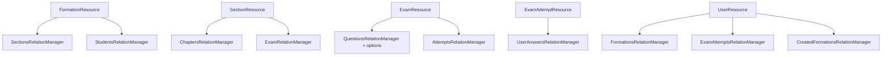

# 00 — Vue d'ensemble & stratégie de migration

## 1. Objectif

Remplacer **intégralement** le panneau d'administration **Filament** (route `/admin`) par une
administration **Inertia + Vue 3 + Tailwind**, cohérente avec le front étudiant déjà migré, sans
dépendance Filament/Livewire pour l'admin.

## 2. Périmètre — inventaire exhaustif de l'existant Filament

### 2.1 Panneau (`AdminPanelProvider`)
- Route `/admin`, `id('admin')`, **SPA**, login Filament, guard `web`.
- Couleurs : primaire `#bf045b`, succès Emerald, warning Orange. Marque « Certification », logo IRMA.
- Découverte automatique de Resources / Pages / Widgets.
- Sidebar repliable. Menu utilisateur : lien **Settings**.
- **Auth** : `Authenticate` + `AdminAccessMiddleware`. `User::canAccessPanel()` ⇒ `isAdmin() || isRoot()`.
- Rôles (`UserRoleEnum`) : `student`, `admin`, `root`, `instructor`.

### 2.2 Ressources (9) et leur rôle

| Ressource | Modèle | Groupe nav | Particularités |
|---|---|---|---|
| FormationResource | `Formation` | Catalogue | CRUD + **SectionsRelationManager**, StudentsRelationManager ; toggle actif ; image, tags, prix |
| SectionResource | `Section` | Catalogue | CRUD + **ChaptersRelationManager** + **ExamRelationManager** ; durée auto |
| ExamResource | `Exam` | Évaluations | examable (Formation/Section) ; **QuestionsRelationManager** (+ options inline) + **AttemptsRelationManager** ; activer/dupliquer |
| ExamAttemptResource | `ExamAttempt` | Évaluations | lecture ; **UserAnswersRelationManager** ; action « compléter » |
| EnrollmentResource | `Enrollment` | Utilisateurs | paiements, **facture PDF**, remboursement, actions groupées |
| UserProgressResource | `UserProgress` | Utilisateurs | suivi ; marquer terminé/commencé ; actions groupées |
| CertificateResource | `Certificate` | Utilisateurs | vérifier, révoquer, télécharger |
| FormationAccessCodeResource | `FormationAccessCode` | Utilisateurs | codes à usage unique |
| UserResource | `User` | Utilisateurs | rôles, mot de passe, avatar, statut |

> **Déjà supprimées** (gérées en imbriqué) : `ChapterResource`, `QuestionResource`,
> `QuestionOptionResource`. Les chapitres se gèrent depuis une **Section**, les questions/options
> depuis un **Examen**. La cible Inertia conserve cette imbrication.

### 2.3 Relation managers (édition imbriquée)

### 2.4 Pages & Widgets
- **Dashboard** (page Filament par défaut) + widgets : `StatsOverview`, `FormationStatsChart`, `UserActivityChart`.
- **Settings** (page personnalisée).

### 2.5 Services métier réutilisés (à NE PAS réécrire)
`ChapterContentService`, `ChapterPdfExtractionService`, `ReadingDurationCalculatorService`,
`DocumentConversionService`, `CourseProgressionService`, `CatalogStatsService`.
Ces services restent en PHP côté serveur ; seuls les écrans Filament sont remplacés.

## 3. Stratégie : « coquille d'abord, ressources ensuite »

1. **Lot 0 — Coquille** : layout admin Vue (`AdminLayout`), middleware `AdminAccessMiddleware`,
   routes `/admin/*` Inertia, page de connexion (réutilise l'auth Inertia existante).
2. **Lot 1 — Composants partagés** : `DataTable`, `ResourceForm`, `Modal/SlideOver`, `FilterBar`,
   `BulkActions`, `ConfirmAction`, `Notification` (cf. doc 01). **C'est ici qu'on évite la complexité.**
3. **Lots 2→6** : une ressource = un contrôleur Inertia + des Form Requests + une page « index »
   (DataTable) + des modales/pages de formulaire, **sans plomberie**.
4. **Lot 7** : suppression de `filament/*`, du `AdminPanelProvider`, des `app/Filament/**`.

## 4. Principes anti‑complexité

- **Un seul layout admin** (`AdminLayout`) ; pas de second layout.
- **Les tables sont serveur** : pagination/tri/recherche/filtre via query params Inertia (comme le
  catalogue étudiant). Pas de state client lourd.
- **Form Requests** Laravel pour toute validation (jamais inline) — réutilisables par create/update.
- **Policies** Laravel pour l'autorisation (remplace les `can()` Filament).
- **Actions = endpoints** : chaque action Filament (activer, dupliquer, rembourser, révoquer…)
  devient une route POST/PATCH + une `ConfirmAction` côté Vue.
- **Réutiliser les services** existants (extraction PDF, progression, stats) tels quels.

## 5. Risques & points de vigilance

| Risque | Mitigation |
|---|---|
| Réécrire la plomberie 9 fois | Lot 1 (composants partagés) **avant** les ressources |
| Perte de l'extraction PDF des chapitres | Réutiliser `ChapterPdfExtractionService` côté contrôleur (cf. PRD 04) |
| Autorisations dispersées | Policies Laravel centralisées + middleware `AdminAccessMiddleware` |
| Uploads (image, avatar, PDF) | `FileUpload` Filament → input file + `store()` Laravel (cf. doc 01 §Uploads) |
| Graphiques des widgets | Une lib Vue légère (Chart.js via `vue-chartjs`) alimentée par un endpoint JSON |
| Champs riches (RichEditor) | Éditeur Markdown/HTML léger (cf. doc 01 §Éditeur) |

## 6. Définition de « terminé »

- `/admin` rend des pages **Inertia** (plus aucune route Livewire/Filament).
- Toutes les ressources, actions, filtres et relation managers ci‑dessus ont un équivalent Vue.
- `composer remove filament/filament` possible ; `app/Filament/**` et `AdminPanelProvider` supprimés.
- Tests features (contrôleurs admin) + tests de rendu des pages verts.
