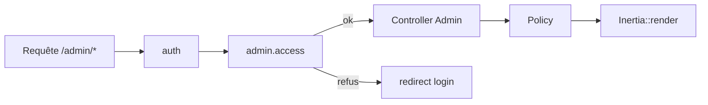
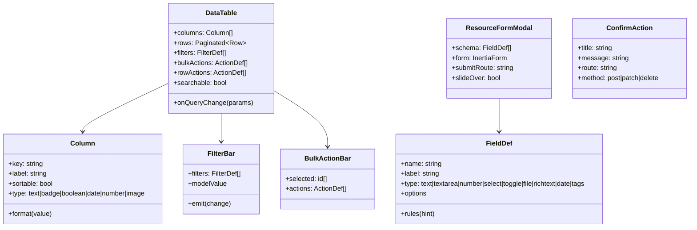
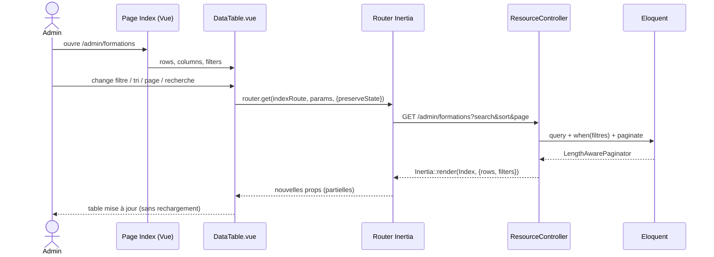
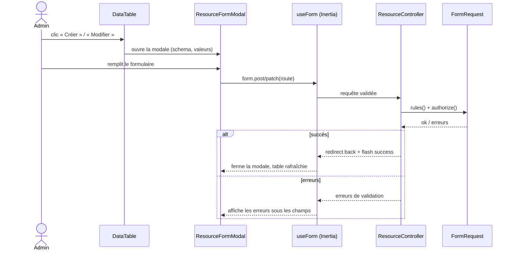

# 01 — Architecture cible (Inertia + Vue) & composants partagés

> Ce document est le **socle**. Tous les PRD de ressources en dépendent. L'objectif est qu'une
> ressource ne décrive que ses **colonnes, champs et actions** — toute la mécanique vient d'ici.

## 1. Pile technique

- **Backend** : Laravel 12, Inertia (déjà en place côté étudiant), Form Requests, Policies.
- **Frontend** : Vue 3 `<script setup lang="ts">`, Tailwind 3, Ziggy (`safeRoute`), `@inertiajs/vue3`.
- **Tables** : pagination/tri/recherche/filtre **côté serveur** via query params (`router.get`,
  `preserveState`), exactement comme le catalogue étudiant (`StudentFormationController`).
- **Graphiques** : `chart.js` + `vue-chartjs` alimentés par des endpoints JSON.

## 2. Routage & contrôleurs

Toutes les routes admin sont préfixées et protégées :

```php
// routes/admin.php (chargé depuis bootstrap/app.php)
Route::middleware(['auth', 'admin.access'])->prefix('admin')->name('admin.')->group(function () {
    Route::get('/', DashboardController::class)->name('dashboard');

    Route::get('formations', [FormationController::class, 'index'])->name('formations.index');
    Route::post('formations', [FormationController::class, 'store'])->name('formations.store');
    Route::patch('formations/{formation}', [FormationController::class, 'update'])->name('formations.update');
    Route::delete('formations/{formation}', [FormationController::class, 'destroy'])->name('formations.destroy');
    Route::post('formations/{formation}/toggle-active', [FormationController::class, 'toggleActive'])->name('formations.toggle-active');
    // ... idem pour chaque ressource
});
```

- `admin.access` = alias du middleware `AdminAccessMiddleware` (déjà existant) qui vérifie
  `auth()->user()->canAccessPanel()` (admin ou root).
- **Autorisation fine** : une `Policy` par modèle (`FormationPolicy`, etc.), `Gate::authorize` dans
  chaque contrôleur.



## 3. Layout admin unique

`resources/js/Layouts/AdminLayout.vue` — **le seul** layout du back‑office :

- Sidebar (groupes : **Catalogue**, **Évaluations**, **Utilisateurs**, **Administration**), repliable,
  item actif via `safeCurrent`.
- Topbar : fil d'ariane (slot `#breadcrumb`), recherche globale optionnelle, menu utilisateur
  (Profil, Paramètres, Déconnexion).
- Conteneur de **notifications** (flash `success`/`error` partagés par `HandleInertiaRequests`).

```
AdminLayout
 ├── AdminSidebar (navigation par groupes)
 ├── AdminTopbar (breadcrumb, user menu)
 └── <slot/>  (page)
```

## 4. Composants partagés (la clé anti‑complexité)



### Catalogue des composants (`resources/js/Components/Admin/`)

| Composant | Rôle | Remplace (Filament) |
|---|---|---|
| `DataTable.vue` | Table serveur : colonnes, tri, pagination, recherche, sélection | `Table`, `Columns\*` |
| `Column*` (cellules) | `TextCell`, `BadgeCell`, `BooleanCell`, `DateCell`, `ImageCell` | `TextColumn`, `IconColumn`… |
| `FilterBar.vue` | Filtres (select, ternaire) → query params | `Filters\*` |
| `ResourceFormModal.vue` | Formulaire create/edit en modale ou slide‑over | `form()`, `CreateAction`, `EditAction` |
| `Field*` (`TextField`, `SelectField`, `ToggleField`, `FileField`, `RichTextField`, `TagsField`, `DateField`) | Champs typés + erreurs | `Forms\Components\*` |
| `ConfirmAction.vue` | Bouton + modale de confirmation → POST/PATCH/DELETE | `Action()->requiresConfirmation()` |
| `BulkActionBar.vue` | Barre d'actions groupées sur sélection | `BulkAction` |
| `StatCard.vue` / `ChartCard.vue` | Cartes stat & graphiques | Widgets |
| `RelationPanel.vue` | Onglet/section listant une relation (sections, chapitres, questions…) | RelationManager |

### Contrat `DataTable` (exemple d'usage dans une page)
```vue
<DataTable
  :rows="formations"            // LengthAwarePaginator sérialisé
  :columns="columns"           // déclaration locale
  :filters="filters"
  :row-actions="rowActions"
  :bulk-actions="bulkActions"
  searchable
  :index-route="safeRoute('admin.formations.index')"
/>
```
La page **ne gère pas** la pagination/tri/recherche : `DataTable` émet les changements et fait le
`router.get(indexRoute, params, { preserveState, replace })`. Le contrôleur lit les `query params`.

## 5. Pattern « contrôleur de ressource »

Chaque ressource suit le **même squelette** (donc trivial à dupliquer) :

```php
final class FormationController extends Controller
{
    public function index(Request $request): Response
    {
        Gate::authorize('viewAny', Formation::class);
        $formations = Formation::query()
            ->when($request->search, fn ($q, $s) => $q->where('title', 'like', "%{$s}%"))
            ->when($request->filled('is_active'), fn ($q) => $q->where('is_active', $request->boolean('is_active')))
            ->when($request->sort, fn ($q) => $q->orderBy($request->sort, $request->dir ?? 'asc'))
            ->paginate(15)->withQueryString();

        return Inertia::render('Admin/Formations/Index', [
            'formations' => $formations,
            'filters' => $request->only('search', 'is_active', 'difficulty_level', 'sort', 'dir'),
        ]);
    }

    public function store(StoreFormationRequest $request): RedirectResponse { /* create */ }
    public function update(UpdateFormationRequest $request, Formation $formation): RedirectResponse { /* update */ }
    public function destroy(Formation $formation): RedirectResponse { /* delete */ }
    public function toggleActive(Formation $formation): RedirectResponse { /* action */ }
}
```

> **Le tri/recherche/filtre/pagination est identique partout** : on peut l'extraire dans un
> trait `HandlesResourceIndex` ou un `QueryBuilder` maison pour ne pas le répéter.

## 6. Correspondances Filament → Inertia (mémo)

| Filament | Cible Inertia/Vue |
|---|---|
| `Resource::form()` | `Field*` dans `ResourceFormModal` + Form Request |
| `Resource::table()` | `DataTable` + déclaration `columns` |
| `Filters\SelectFilter` / `TernaryFilter` | `FilterBar` (select / tri‑état) → query param |
| `CreateAction` / `EditAction` | `ResourceFormModal` (create/edit) → `store`/`update` |
| `DeleteAction` / `requiresConfirmation()` | `ConfirmAction` (method delete) |
| `BulkAction` | `BulkActionBar` → endpoint « bulk » |
| `Action::make('x')` (custom) | route POST/PATCH dédiée + bouton/`ConfirmAction` |
| `RelationManager` | `RelationPanel` (onglet) listant la relation + ses actions |
| `FileUpload` | `FileField` (input file) + `store()` Laravel + disque `public` |
| `RichEditor` | `RichTextField` (éditeur léger, sortie HTML/Markdown) |
| Widget (stat) | `StatCard` + endpoint JSON |
| Widget (chart) | `ChartCard` (vue-chartjs) + endpoint JSON |
| `canAccessPanel()` | middleware `admin.access` |
| `can()` par action | `Policy` + `Gate::authorize` |
| Notifications Filament | flash Inertia (`with('success'…)`) + `Notification.vue` |

## 7. Uploads, éditeur, autorisation

- **Uploads** : `<input type=file>` → `multipart` Inertia → `Request::file()->store('dir','public')`.
  Réutiliser `ChapterPdfExtractionService` après upload (PRD 04).
- **Éditeur riche** : champ `RichTextField` (ex. TipTap ou textarea Markdown) ; le rendu HTML
  réutilise `MarkdownToHtmlConverter` côté serveur.
- **Autorisation** : `Policy` par modèle (admin/root = autorisés). Le middleware `admin.access`
  garde l'accès global ; les Policies affinent (utile si rôle `instructor` plus tard).

## 8. Séquence de référence — affichage + filtrage d'une table



## 9. Séquence de référence — création/édition via modale


