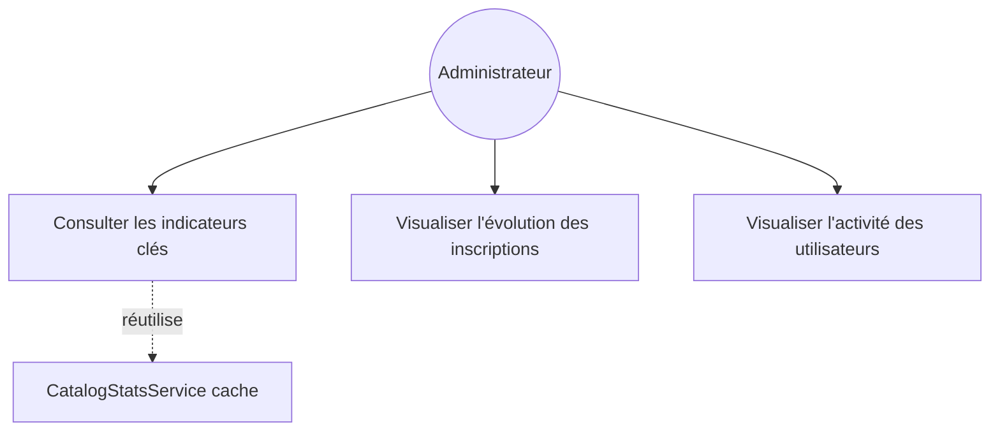
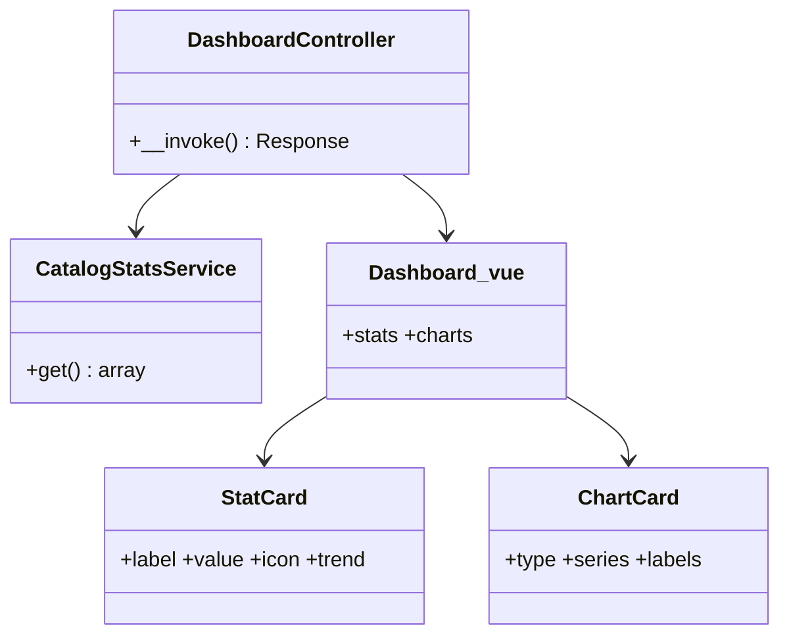
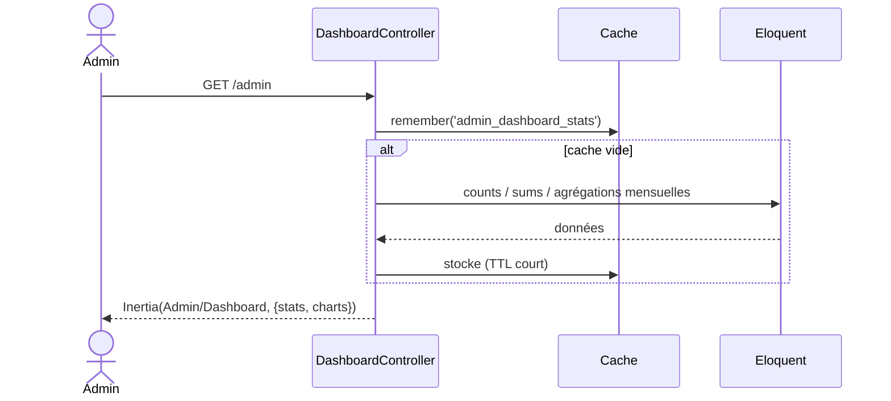

# 02 — PRD : Tableau de bord & statistiques

## 1. Objectif
Remplacer la page Dashboard Filament et ses widgets (`StatsOverview`, `FormationStatsChart`,
`UserActivityChart`) par une page Inertia `Admin/Dashboard` affichant cartes de stats + graphiques.

## 2. Existant Filament
- **Dashboard** : page par défaut Filament agrégeant des widgets.
- **StatsOverview** : cartes (ex. nombre de formations, sections, examens, inscriptions, certificats,
  apprenants, revenus, tentatives) issues de requêtes `count/sum/avg`.
- **FormationStatsChart** : graphique (formations/inscriptions dans le temps).
- **UserActivityChart** : graphique d'activité utilisateurs.

## 3. Cible Inertia/Vue
- **Route** : `GET /admin` → `DashboardController@__invoke` → `Admin/Dashboard`.
- **Contrôleur** : calcule les compteurs (réutilise `CatalogStatsService` pour le catalogue) et les
  séries de graphiques (agrégation par mois). Met les compteurs lourds en cache (`Cache::remember`).
- **Endpoints graphiques** (optionnels, si rafraîchissement async) :
  `GET /admin/stats/formations`, `GET /admin/stats/activity` → JSON.
- **Page Vue** `Admin/Dashboard.vue` : grille de `StatCard` + `ChartCard` (vue-chartjs).

### Données fournies
```php
return Inertia::render('Admin/Dashboard', [
  'stats' => [
    'formations' => …, 'sections' => …, 'exams' => …,
    'enrollments' => …, 'activeEnrollments' => …, 'certificates' => …,
    'students' => …, 'revenue' => …, 'attempts' => …,
  ],
  'charts' => [
    'enrollmentsByMonth' => [...], 'activityByDay' => [...],
  ],
]);
```

## 4. Cas d'utilisation


## 5. Classes participantes


## 6. Séquence


## 7. Règles métier
- Revenus = somme `amount_paid` des inscriptions payées.
- Apprenants = utilisateurs `role = student`.
- Cache des compteurs (TTL ~5 min) pour éviter de recompter à chaque affichage.

## 8. Critères d'acceptation
- [ ] `/admin` affiche les mêmes indicateurs que `StatsOverview`.
- [ ] 2 graphiques (inscriptions, activité) rendus avec données réelles.
- [ ] Aucune dépendance Filament/Livewire sur la page.
