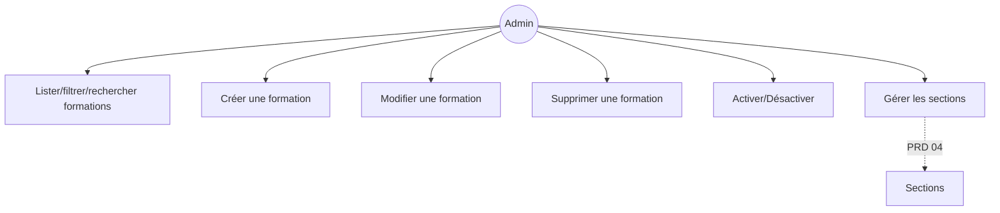
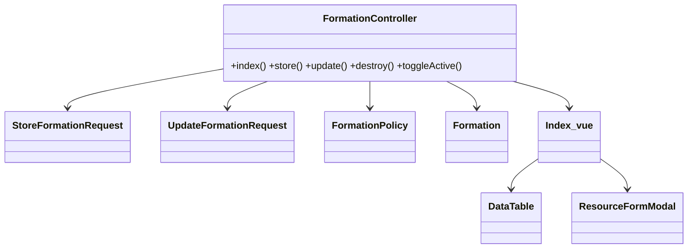
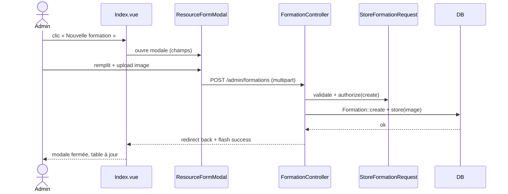

# 03 — PRD : Formations

## 1. Objectif
Migrer `FormationResource` (CRUD + relation sections/étudiants + activation) vers Inertia/Vue.

## 2. Existant Filament
**Champs (form)** : `title`, `slug`, `short_description`, `description` (RichEditor), `image`
(FileUpload), `difficulty_level` (select), `duration_hours`, `price`, `tags`, `is_featured`,
`is_active`.
**Colonnes (table)** : titre, image, niveau, durée, prix, vedette, actif, compteurs (sections,
chapitres, inscrits via `withCount`).
**Filtres** : `is_active` (ternaire), `is_featured` (ternaire), `difficulty_level` (select).
**Action custom** : `toggle_active`.
**Relation managers** : `SectionsRelationManager` (sections imbriquées), `StudentsRelationManager`
(inscrits). *(cf. PRD 04 pour les sections.)*

## 3. Cible Inertia/Vue
- **Routes** : `admin.formations.{index,store,update,destroy,toggle-active}`.
- **Contrôleur** : `FormationController` (squelette doc 01 §5) + `withCount(catalogCountRelations())`.
- **Form Requests** : `StoreFormationRequest`, `UpdateFormationRequest` (slug auto via `HasSlug`).
- **Pages Vue** :
  - `Admin/Formations/Index.vue` : `DataTable` (colonnes ci‑dessus) + `FilterBar` + `ResourceFormModal`
    (create/edit slide‑over) + `ConfirmAction` (delete) + bouton `toggle-active`.
  - `Admin/Formations/Show.vue` (optionnel) : détail + onglets `RelationPanel` **Sections** / **Inscrits**.
- **Upload image** : `FileField` → `store('formations','public')`.

### Schéma de champs (déclaration)
| Champ | Type | Règles |
|---|---|---|
| title | text | required, max:255 |
| short_description | textarea | nullable |
| description | richtext | nullable |
| image | file (image) | nullable, image, max:2048 |
| difficulty_level | select(beginner/intermediate/advanced) | required |
| duration_hours | number | nullable, min:0 |
| price | number | nullable, min:0 |
| tags | tags | nullable |
| is_featured | toggle | bool |
| is_active | toggle | bool (def. true) |

## 4. Cas d'utilisation

## 5. Classes participantes

## 6. Séquence — création

## 7. Règles métier & validation
- `slug` généré depuis `title` (trait `HasSlug`) — non éditable.
- `image` stockée sur le disque `public` ; suppression de l'ancienne au remplacement.
- `toggle_active` : `PATCH` inversant `is_active`.
- Suppression : confirmer ; cascade sections/chapitres selon contraintes FK.

## 8. Critères d'acceptation
- [ ] Lister/filtrer (actif, vedette, niveau)/rechercher/trier/paginer.
- [ ] Créer, modifier, supprimer, basculer l'activation.
- [ ] Compteurs sections/chapitres/inscrits affichés.
- [ ] Accès aux sections de la formation (onglet → PRD 04).
