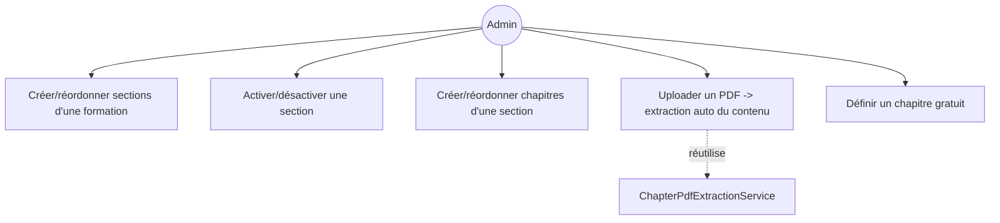
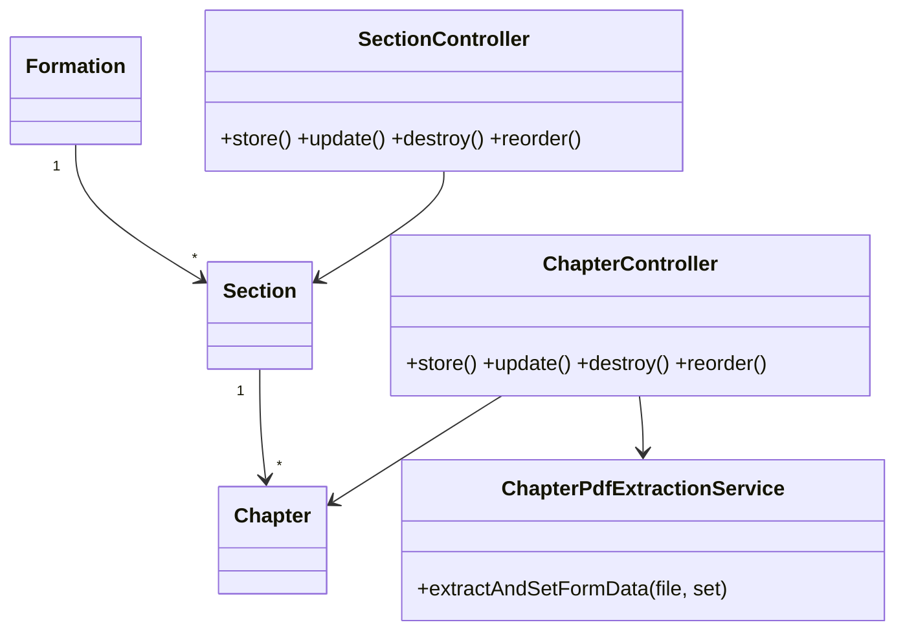
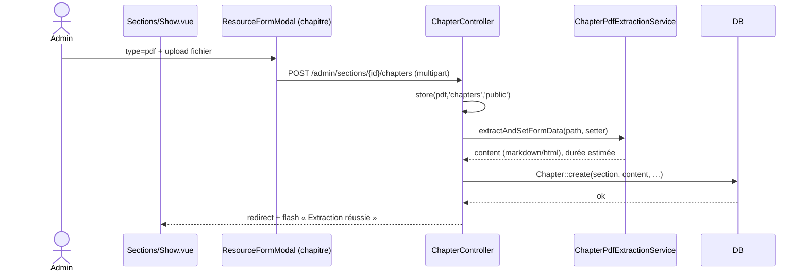
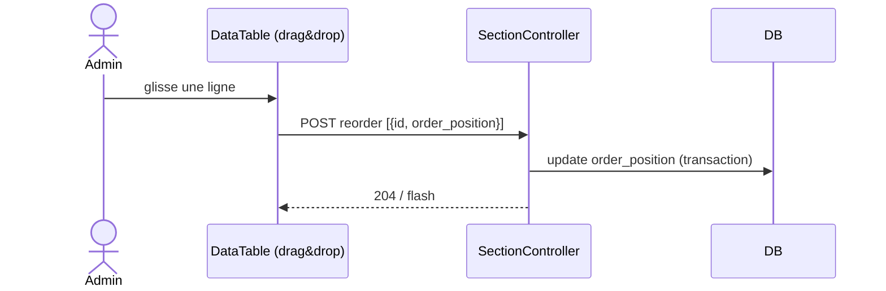

# 04 — PRD : Sections & Chapitres (imbriqués)

## 1. Objectif
Migrer l'édition imbriquée **Formation → Sections → Chapitres** (relation managers Filament) et
conserver l'**extraction automatique de contenu PDF** des chapitres.

## 2. Existant Filament
- **SectionResource** : `formation_id`, `title` (unique), `description` (RichEditor),
  `order_position` (auto = max+1), `duration` (auto depuis la durée formation), `is_active`.
  Table réordonnable (`reorderable('order_position')`), action groupée activer/désactiver.
- **SectionsRelationManager** (sur Formation) : créer/réordonner les sections, action
  « Chapitres & examen » → page section.
- **ChaptersRelationManager** (sur Section) : `title`, `content_type` (video/text/pdf),
  `media_url`/`video_url` (FileUpload), `content` (RichEditor), `duration_minutes`, `is_free`,
  `is_active`, `order_position`. **Extraction PDF** via `ChapterPdfExtractionService` au create.
- **ExamRelationManager** (sur Section) : l'examen de la section *(cf. PRD 05)*.

## 3. Cible Inertia/Vue
- **Routes**
  - Sections : `admin.formations.sections.{index,store,update,destroy,reorder}` (imbriquées sous formation).
  - Chapitres : `admin.sections.chapters.{index,store,update,destroy,reorder}`.
- **Contrôleurs** : `SectionController`, `ChapterController`.
- **Form Requests** : `Store/UpdateSectionRequest`, `Store/UpdateChapterRequest`.
- **Pages Vue**
  - `Admin/Formations/Show.vue` → `RelationPanel` **Sections** (DataTable réordonnable + modale).
  - `Admin/Sections/Show.vue` → `RelationPanel` **Chapitres** (DataTable réordonnable + modale) +
    `RelationPanel` **Examen** (PRD 05).
- **Réordonnancement** : drag‑and‑drop → `POST reorder` avec `[{id, order_position}]`.
- **Extraction PDF** : à l'upload d'un chapitre `content_type = pdf`, le contrôleur appelle
  `ChapterPdfExtractionService` et remplit `content` automatiquement (réutilisation **stricte** du service).

### Champs Chapitre (déclaration)
| Champ | Type | Visible si | Règles |
|---|---|---|---|
| title | text | — | required |
| content_type | select(video/text/pdf) | — | required |
| video_url | file (video/*) | type=video | required si video |
| media_url | file (application/pdf) | type=pdf | required si pdf |
| content | richtext | type=text (ou auto‑rempli si pdf) | nullable |
| duration_minutes | number | — | nullable |
| is_free | toggle | — | bool |
| is_active | toggle | — | bool |

> `content_type` est limité à **video / text / pdf** (l'enum `ChapterTypeEnum` n'a plus `audio`).

## 4. Cas d'utilisation

## 5. Classes participantes

## 6. Séquence — création d'un chapitre PDF avec extraction

## 7. Séquence — réordonnancement

## 8. Règles métier & validation
- `Section.title` **unique** (contrainte BDD) → règle `unique` (ignore en édition).
- `order_position` auto = `max+1` à la création ; recalculé au drag‑and‑drop.
- `duration` de section : calcul auto possible (durée formation / nb sections) — conserver la logique
  existante (`Section::booted`).
- Chapitre `content_type = pdf` ⇒ extraction obligatoire ; en cas d'échec, garder le PDF et notifier.
- Suppression d'une section : confirmer (impacte chapitres + examen + progression).

## 9. Critères d'acceptation
- [ ] Sections gérées **depuis la formation** (liste, création, réordonnancement, activation).
- [ ] Chapitres gérés **depuis la section** (liste, création, réordonnancement, gratuit/actif).
- [ ] Upload PDF → contenu extrait automatiquement (service réutilisé, non réécrit).
- [ ] Types de chapitre limités à video/text/pdf.
- [ ] L'examen de la section est accessible depuis la même page (PRD 05).
