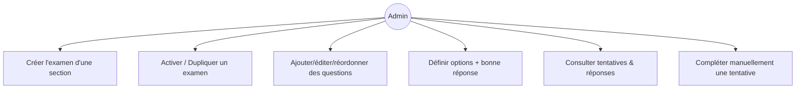
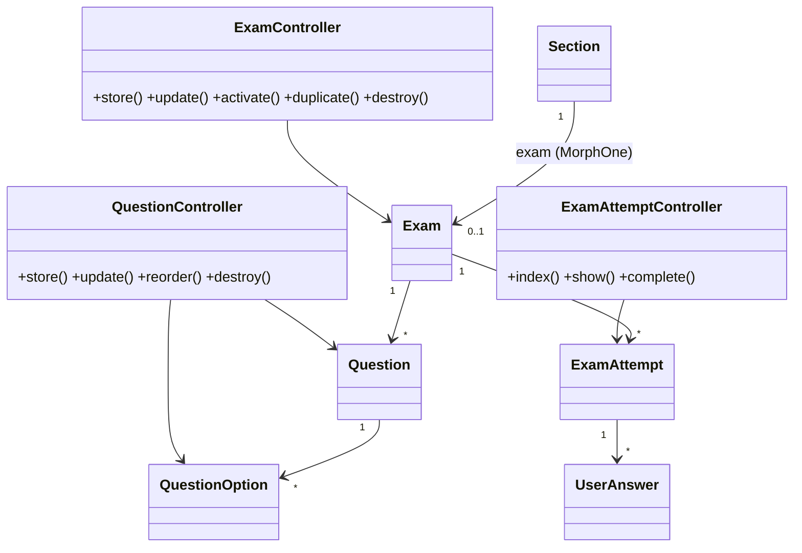
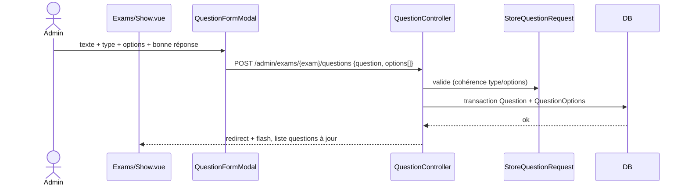
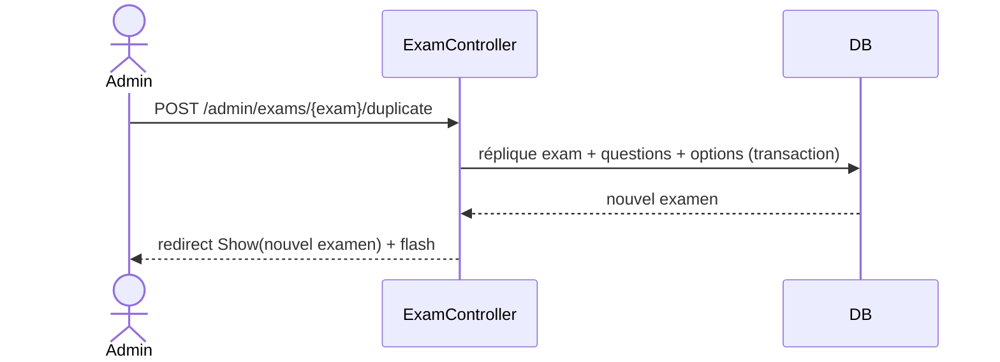

# 05 — PRD : Examens, Questions, Options & Tentatives

## 1. Objectif
Migrer la gestion des **examens** (1 par section), de leurs **questions** (+ options inline) et la
consultation des **tentatives** et **réponses**.

## 2. Existant Filament
- **ExamResource** : `examable_type` (Formation/Section), `formation_id`/`examable_id`, `title`,
  `description`, `instructions` (RichEditor), `duration_minutes`, `passing_score`, `max_attempts`,
  `randomize_questions`, `show_results_immediately`, `is_active`, `available_from/until`.
  Actions custom : `activate`, `deactivate`, `duplicate`. Table groupée par `examable_type`.
- **QuestionsRelationManager** (sur Exam) : `question_text`, `question_type`
  (**single_choice / multiple_choice / true_false** uniquement), `points`, `is_required`,
  `order_position`, `explanation`, + **Repeater d'options** (`option_text`, `is_correct`, ordre).
- **AttemptsRelationManager** (sur Exam) : lecture des tentatives.
- **ExamAttemptResource** : lecture (`user`, `exam`, `score`, `percentage`, `status`, durée) +
  **UserAnswersRelationManager** ; action `complete`.

> Côté métier : un examen de **section** est passé après tous les chapitres, et **doit être réussi**
> pour débloquer la section suivante (cf. `course-progression-and-certificates`). La migration admin
> ne change pas ces règles serveur.

## 3. Cible Inertia/Vue
- **Routes**
  - Examens : `admin.exams.{index,store,update,destroy}`, `+ activate, duplicate`.
    Création **imbriquée** possible : `admin.sections.exam.store` (examable = section implicite).
  - Questions : `admin.exams.questions.{store,update,destroy,reorder}` (options incluses dans le payload).
  - Tentatives : `admin.attempts.{index,show}`, `+ complete`.
- **Contrôleurs** : `ExamController`, `QuestionController`, `ExamAttemptController`.
- **Form Requests** : `Store/UpdateExamRequest`, `Store/UpdateQuestionRequest` (valide les options
  selon le type), `CompleteAttemptRequest`.
- **Pages Vue**
  - `Admin/Exams/Index.vue` (DataTable + filtres) et `Admin/Exams/Show.vue` :
    `RelationPanel` **Questions** (DataTable réordonnable + `QuestionFormModal` avec sous‑liste d'options) +
    `RelationPanel` **Tentatives** (lecture).
  - `Admin/Sections/Show.vue` : `RelationPanel` **Examen** (créer/éditer l'examen de la section,
    lien « Gérer les questions » → `Admin/Exams/Show`).
  - `Admin/Attempts/Show.vue` : détail tentative + réponses (UserAnswers).

### Form Question (validation par type)
| Type | Options | Bonne réponse |
|---|---|---|
| single_choice | ≥ 2 options | exactement 1 `is_correct` |
| multiple_choice | ≥ 2 options | ≥ 1 `is_correct` |
| true_false | 2 options (Vrai/Faux) | 1 `is_correct` |

> `QuestionFormModal` gère la **sous‑liste d'options** (ajout/suppression/cocher la bonne réponse),
> remplaçant le `Repeater` Filament. Le payload `options[]` part avec la question.

## 4. Cas d'utilisation

## 5. Classes participantes

## 6. Séquence — créer une question avec options

## 7. Séquence — dupliquer un examen

## 8. Règles métier & validation
- `passing_score` ∈ [0,100] ; `max_attempts` ≥ 0 (`0` = illimité).
- Un examen de section : `examable` implicite = la section (1 seul, `MorphOne`).
- Validation `Store/UpdateQuestionRequest` selon le type (cf. table §3).
- `activate/deactivate` : `PATCH is_active`. `complete` (tentative) : recalcul score/percentage.
- Suppression examen : confirmer (impacte questions, tentatives, déblocage de section).

## 9. Critères d'acceptation
- [ ] Examen créé/édité **depuis la section** (examable implicite) + liste globale des examens.
- [ ] Questions + options gérées en imbriqué, réordonnables, validées selon le type.
- [ ] Types limités à single_choice / multiple_choice / true_false.
- [ ] Activer / dupliquer un examen.
- [ ] Tentatives et réponses consultables ; complétion manuelle possible.
