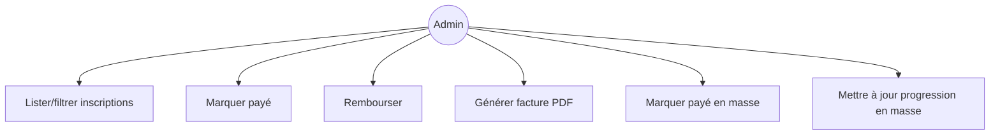
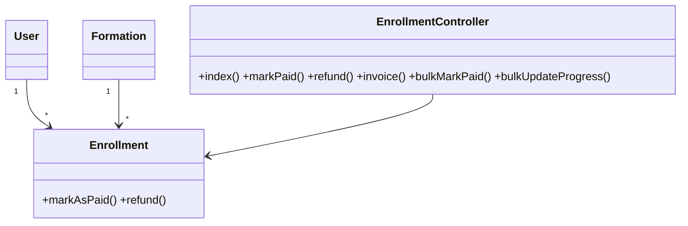
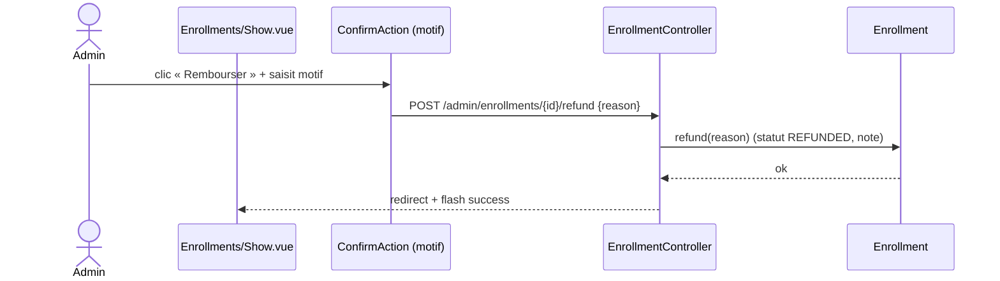

# 06 — PRD : Inscriptions & Paiements

## 1. Objectif
Migrer `EnrollmentResource` : suivi des inscriptions, statuts de paiement, **facture PDF**,
**remboursement**, et actions groupées.

## 2. Existant Filament
**Champs/colonnes** : `user_id`, `formation_id`, `status`, `enrollment_date`, `completion_date`,
`amount_paid`, `payment_status`, `payment_method`, `payment_gateway`, `payment_transaction_id`,
`payment_processed_at`, `payment_notes`, `refund_reason`, `payment_gateway_response`.
**Filtres** : `status`, `payment_status`, `payment_method`.
**Actions** : `markPaid`, `refund`, `generateInvoice` (facture PDF) ; **actions groupées**
`bulk_mark_paid`, `bulk_update_progress`. Filtres rapides `active_paid`, `pending_payment`, `completed`.

## 3. Cible Inertia/Vue
- **Routes** : `admin.enrollments.{index,show,update,destroy}`,
  `+ mark-paid, refund, invoice (GET pdf), bulk-mark-paid, bulk-update-progress`.
- **Contrôleur** : `EnrollmentController` (+ réutilise `Enrollment::markAsPaid()` / `refund()` existants).
- **Form Requests** : `RefundEnrollmentRequest` (motif), `BulkUpdateProgressRequest`.
- **Facture** : `GET /admin/enrollments/{enrollment}/invoice` → contrôleur rendant la vue facture
  (réutiliser l'`EnrollmentController` étudiant existant `enrollments.invoice` / la vue `invoices`).
- **Pages Vue** : `Admin/Enrollments/Index.vue` (DataTable + FilterBar + BulkActionBar) ;
  `Admin/Enrollments/Show.vue` (détail paiement + actions `markPaid`/`refund`/`invoice`).

## 4. Cas d'utilisation

## 5. Classes participantes

## 6. Séquence — remboursement

## 7. Règles métier & validation
- `markPaid` ⇒ `payment_status=paid`, `status=active`, date de traitement (méthode modèle existante).
- `refund` ⇒ `payment_status=refunded`, `status=suspended`, motif horodaté.
- Actions groupées : opèrent sur les ids sélectionnés (transaction).
- Facture : accessible seulement pour les inscriptions payées.

## 8. Critères d'acceptation
- [ ] Lister/filtrer (statut, paiement, méthode) + filtres rapides.
- [ ] Marquer payé, rembourser (avec motif), générer la facture PDF.
- [ ] Actions groupées : payé en masse, progression en masse.
