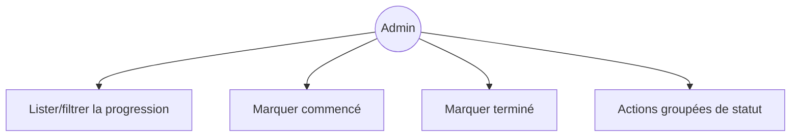
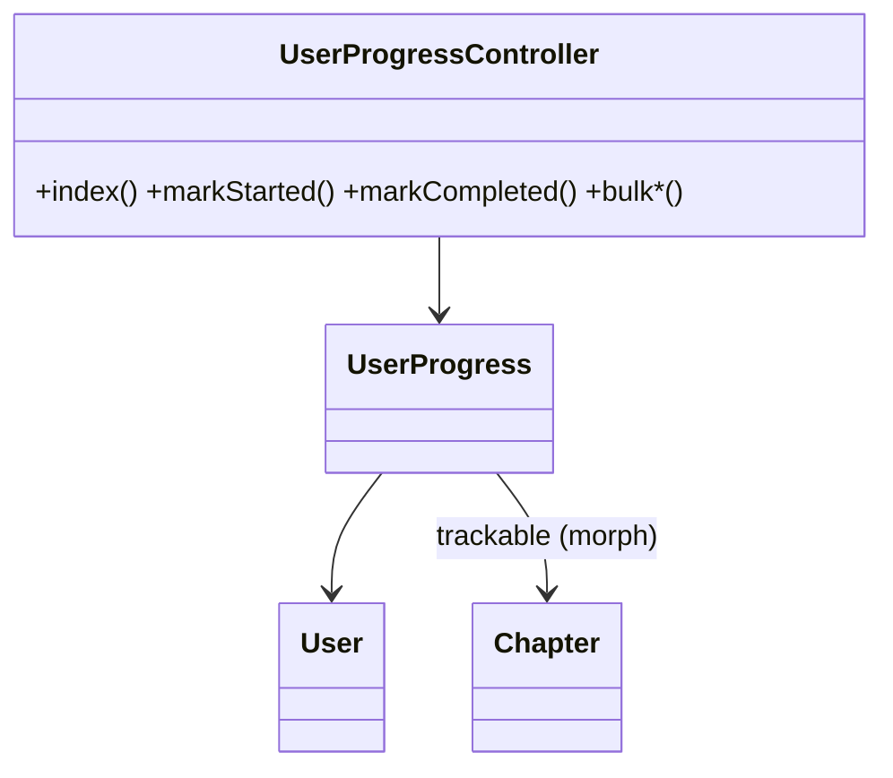
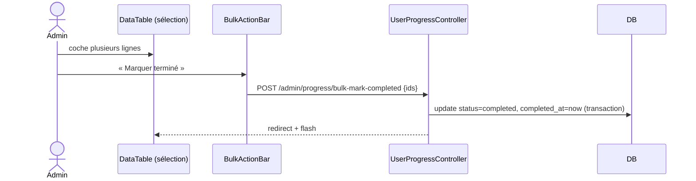

# 07 — PRD : Progression des apprenants

## 1. Objectif
Migrer `UserProgressResource` : suivi de la progression (chapitres) par apprenant.

## 2. Existant Filament
**Colonnes** : `user.name`, `trackable_type`, `trackable.title`, `formation_title`, `status`,
`time_spent`, `started_at`, `completed_at`.
**Filtres** : `status`, `trackable_type`. Filtres rapides `not_started`, `in_progress`,
`high_progress`, `completed`.
**Actions** : `markAsStarted`, `markAsCompleted` ; groupées `bulk_mark_started`, `bulk_mark_completed`.

## 3. Cible Inertia/Vue
- **Routes** : `admin.progress.{index}`, `+ mark-started, mark-completed, bulk-mark-started, bulk-mark-completed`.
- **Contrôleur** : `UserProgressController` (lecture + actions de statut).
- **Pages Vue** : `Admin/Progress/Index.vue` (DataTable + FilterBar + BulkActionBar). Lecture seule sur
  les données ; seules les transitions de statut sont des actions.
- Eager‑load `trackable` (morph) + `user` pour éviter le N+1.

## 4. Cas d'utilisation

## 5. Classes participantes

## 6. Séquence — marquer terminé (en masse)

## 7. Règles métier
- Statuts : `not_started`, `in_progress`, `completed` (`UserProgressEnum`).
- `markAsCompleted` ⇒ `completed_at = now`.
- Cohérence : la progression réelle reste pilotée côté étudiant (`CourseProgressionService`) ; l'admin
  ne fait que des corrections ponctuelles.

## 8. Critères d'acceptation
- [ ] Lister/filtrer (statut, type, filtres rapides).
- [ ] Marquer commencé/terminé, individuellement et en masse.
- [ ] Pas de N+1 (eager‑load trackable + user).
