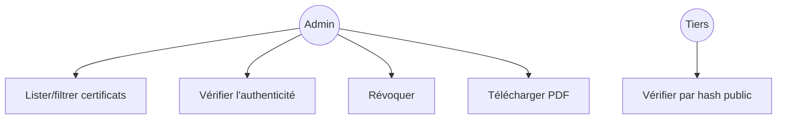
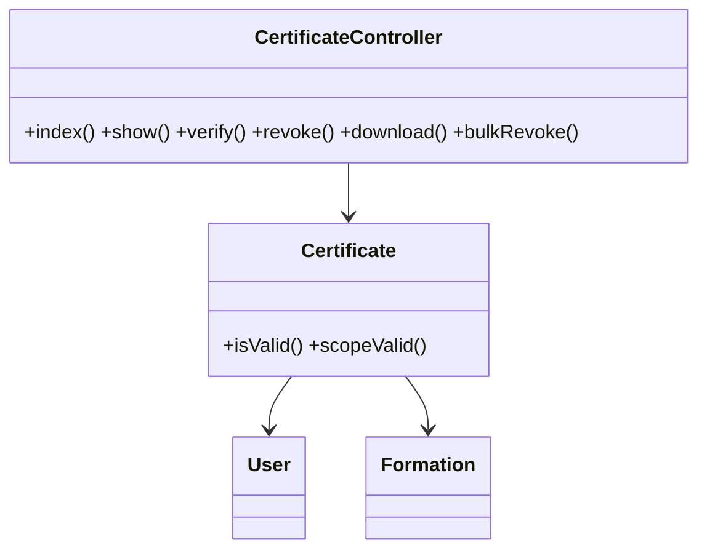
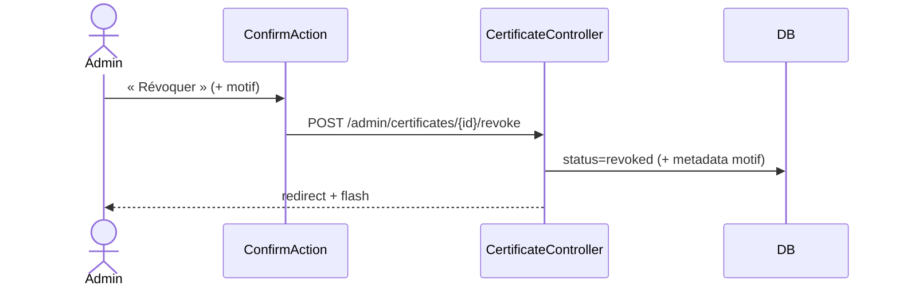

# 08 — PRD : Certificats

## 1. Objectif
Migrer `CertificateResource` : consultation, **vérification**, **révocation**, **téléchargement** des
certificats (émis automatiquement côté étudiant à la réussite des examens de section).

## 2. Existant Filament
**Colonnes** : `certificate_number`, `user.name`, `formation.title`, `final_score`, `issue_date`,
`expiry_date`, `status`, `metadata`. **Filtre** : `status`. Filtres rapides `valid`, `expired`,
`high_score`. **Actions** : `verify`, `revoke`, `download` ; groupée `bulk_revoke`.

> Émission **automatique** par `CourseProgressionService` (réussite de tous les examens de section).
> L'admin **n'émet pas** manuellement en standard ; il consulte/révoque/vérifie.

## 3. Cible Inertia/Vue
- **Routes** : `admin.certificates.{index,show}`, `+ verify (GET public/par hash), revoke, download (GET pdf), bulk-revoke`.
- **Contrôleur** : `CertificateController`.
- **Form Requests** : `RevokeCertificateRequest` (motif optionnel).
- **Pages Vue** : `Admin/Certificates/Index.vue` (DataTable + FilterBar + BulkActionBar) ;
  `Admin/Certificates/Show.vue` (aperçu certificat + actions). Réutiliser la vue d'affichage existante
  `Dashboard/Formations/Certifications/Show.vue` comme base visuelle.
- **Vérification** : page publique `/certificats/verifier/{hash}` (lecture seule) — utile pour les tiers.

## 4. Cas d'utilisation

## 5. Classes participantes

## 6. Séquence — révocation

## 7. Règles métier
- Statuts (`CertificateStatusEnum`) : `active`, `revoked`, `expired`.
- `isValid()` = `active` ET (pas d'expiration OU future).
- `verify` : recherche par `verification_hash` ; renvoie validité + détails.
- `download` : génère/retourne le PDF du certificat.

## 8. Critères d'acceptation
- [ ] Lister/filtrer (statut, filtres rapides).
- [ ] Vérifier, révoquer (individuel + masse), télécharger.
- [ ] Page de vérification publique par hash.
