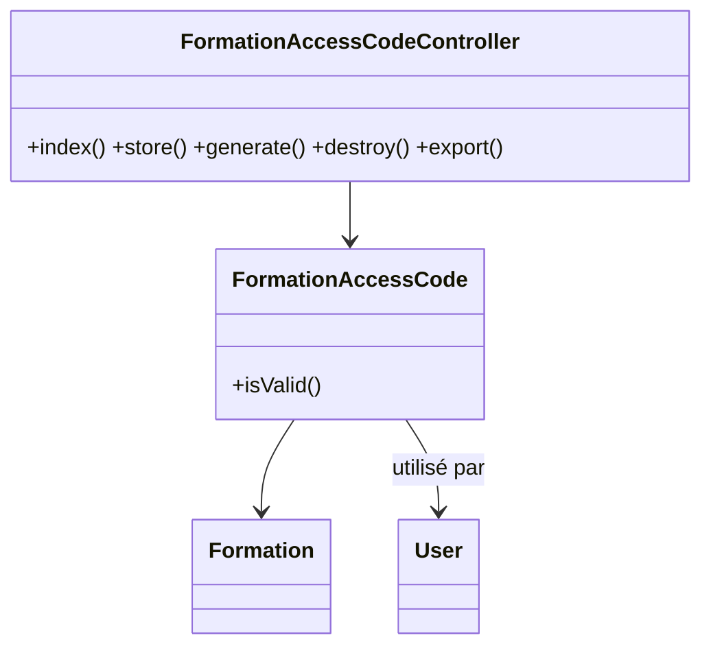
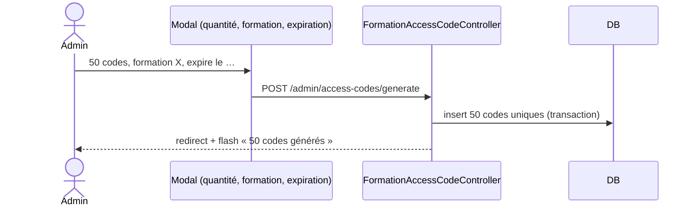

# 09 — PRD : Codes d'accès formation

## 1. Objectif
Migrer `FormationAccessCodeResource` : génération et suivi des **codes d'accès à usage unique** qui
permettent à un étudiant de s'inscrire gratuitement à une formation (cf. `FormationAccessController`).

## 2. Existant Filament
**Champs/colonnes** : `formation_id`, `code`, `user_id` (qui l'a utilisé), `is_used`, `used_at`,
`expires_at`. **Filtres** : `formation`, `is_used`.

## 3. Cible Inertia/Vue
- **Routes** : `admin.access-codes.{index,store,destroy}`, `+ generate (lot), export (CSV)`.
- **Contrôleur** : `FormationAccessCodeController`.
- **Form Requests** : `StoreAccessCodeRequest`, `GenerateAccessCodesRequest` (quantité + formation + expiration).
- **Pages Vue** : `Admin/AccessCodes/Index.vue` (DataTable + FilterBar). Action « Générer N codes ».
- **Génération** : crée N codes uniques (`Str::random`/format) pour une formation.

## 4. Cas d'utilisation
```mermaid
flowchart TD
  A((Admin)) --> G[Générer un lot de codes]
  A --> L[Lister/filtrer (formation, utilisés)]
  A --> S[Supprimer un code non utilisé]
  A --> E[Exporter en CSV]
  ST((Étudiant)) --> U[Utiliser un code -> inscription]
```

## 5. Classes participantes


## 6. Séquence — génération d'un lot


## 7. Règles métier
- `code` unique par formation ; `is_used=false` à la création.
- `isValid()` = non utilisé ET (pas d'expiration OU future).
- Suppression interdite si déjà utilisé (ou avertir).

## 8. Critères d'acceptation
- [ ] Générer un lot, lister/filtrer (formation, utilisés), supprimer, exporter.
- [ ] Codes uniques et expirables.
