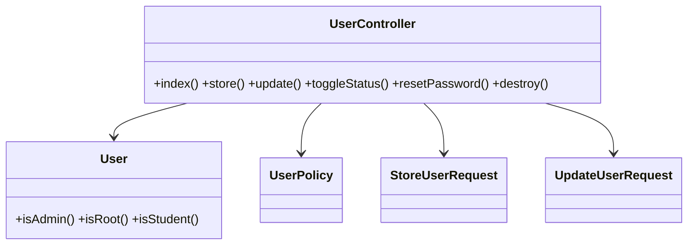
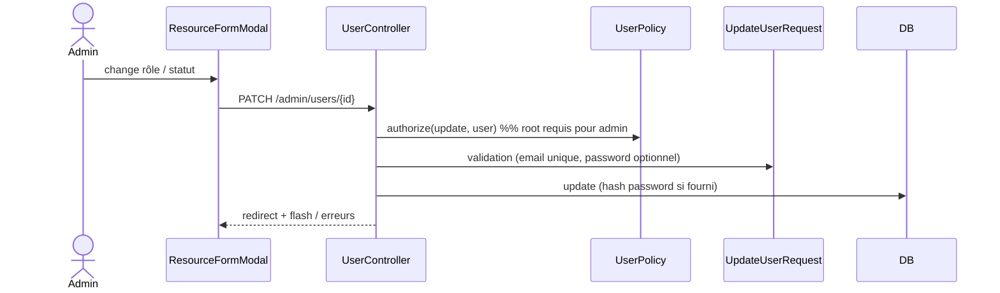

# 10 — PRD : Utilisateurs & rôles

## 1. Objectif
Migrer `UserResource` : gestion des comptes (apprenants, admins), rôles, statut, mot de passe, avatar.

## 2. Existant Filament
**Champs** : `name`, `username`, `email`, `phone`, `avatar` (FileUpload), `role` (select),
`status` (select), `password` + `password_confirmation`, `email_verified`, `must_change_password`.
**Filtres** : `role`, `status`. **Action** : `toggle_status`.
**Relation managers** : `FormationsRelationManager` (inscriptions), `ExamAttemptsRelationManager`
(tentatives), `CreatedFormationsRelationManager` (formations créées).

## 3. Cible Inertia/Vue
- **Routes** : `admin.users.{index,store,update,destroy}`, `+ toggle-status, reset-password`.
- **Contrôleur** : `UserController`.
- **Form Requests** : `StoreUserRequest`, `UpdateUserRequest` (mot de passe optionnel en édition,
  `email` unique sauf soi‑même, confirmation).
- **Policy** : seul `root` peut créer/éditer un `admin` ; un admin gère les apprenants.
- **Pages Vue** : `Admin/Users/Index.vue` (DataTable + FilterBar) ;
  `Admin/Users/Show.vue` (profil + onglets `RelationPanel` Inscriptions / Tentatives / Formations créées).
- **Avatar** : `FileField` (image) → disque public.

### Champs (déclaration)
| Champ | Type | Règles |
|---|---|---|
| name | text | required |
| username | text | required, unique |
| email | text | required, email, unique |
| phone | text | nullable |
| role | select(student/instructor/admin/root) | required ; **root only** pour admin/root |
| status | select | required |
| avatar | file (image) | nullable |
| password | password | required(create) / nullable(edit), confirmed |
| must_change_password | toggle | bool |

## 4. Cas d'utilisation
```mermaid
flowchart TD
  A((Admin)) --> L[Lister/filtrer (rôle, statut)]
  A --> C[Créer un utilisateur]
  A --> E[Éditer (rôle, statut, mot de passe)]
  A --> T[Activer/Désactiver]
  A --> R[Réinitialiser le mot de passe]
  Root((Root)) --> AA[Gérer les admins]
```

## 5. Classes participantes


## 6. Séquence — édition avec changement de rôle


## 7. Règles métier & sécurité
- Mot de passe **hashé** ; en édition, ne changer que si fourni.
- `email`/`username` uniques (ignore soi‑même).
- Élévation de privilège protégée par `UserPolicy` (root pour admin/root).
- `toggle_status` : actif/inactif. `must_change_password` force le changement à la prochaine connexion.

## 8. Critères d'acceptation
- [ ] CRUD utilisateurs + filtres (rôle, statut).
- [ ] Gestion mot de passe (création/réinitialisation), avatar.
- [ ] Garde‑fous de rôle (root vs admin).
- [ ] Onglets relations (inscriptions, tentatives, formations créées).
