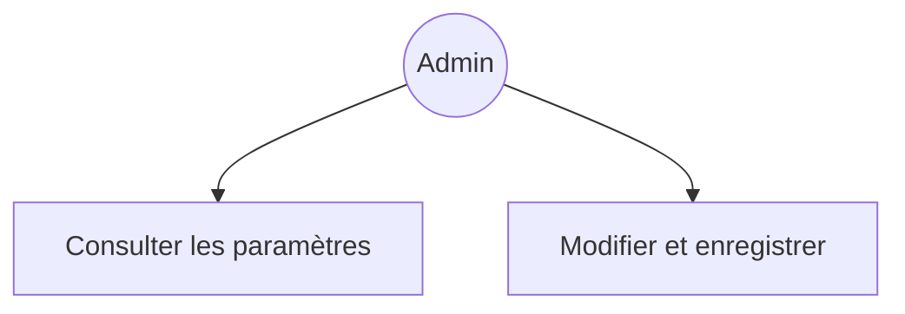
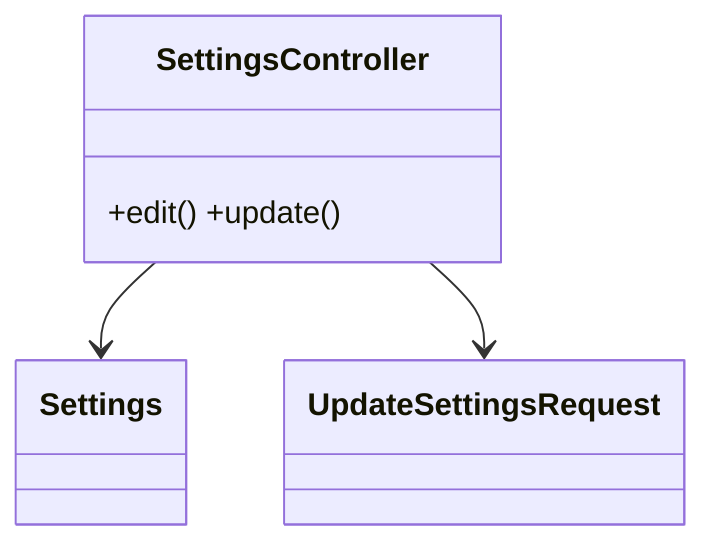
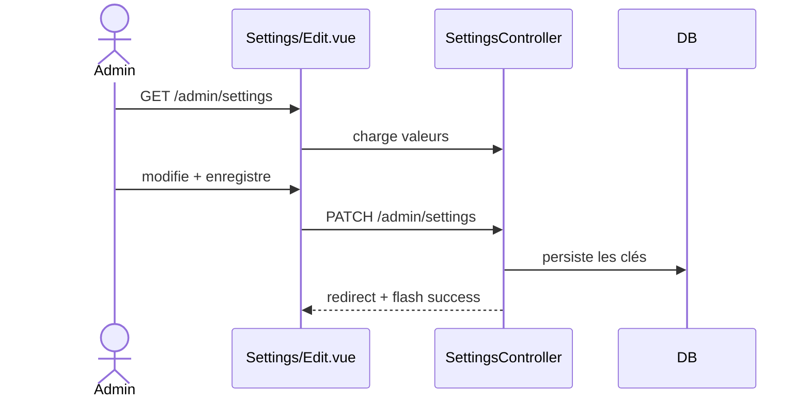

# 11 — PRD : Paramètres

## 1. Objectif
Migrer la page **Settings** Filament (page personnalisée, `wire:submit="save"`) vers une page Inertia.

## 2. Existant Filament
- Page `app/Filament/Pages/Settings.php` + vue `filament/pages/settings.blade.php` (formulaire Livewire).
- Stocke des réglages applicatifs (table `settings` / clé‑valeur).

## 3. Cible Inertia/Vue
- **Routes** : `admin.settings.{edit,update}`.
- **Contrôleur** : `SettingsController` (`edit` rend le formulaire, `update` persiste).
- **Form Request** : `UpdateSettingsRequest`.
- **Page Vue** : `Admin/Settings/Edit.vue` (formulaire simple via `ResourceFormModal` ou page dédiée).
- Réutiliser le modèle/service `Settings` existant pour lire/écrire les clés.

## 4. Cas d'utilisation

## 5. Classes participantes

## 6. Séquence

## 7. Critères d'acceptation
- [ ] Lecture/écriture des paramètres sans Livewire.
- [ ] Validation via Form Request.
