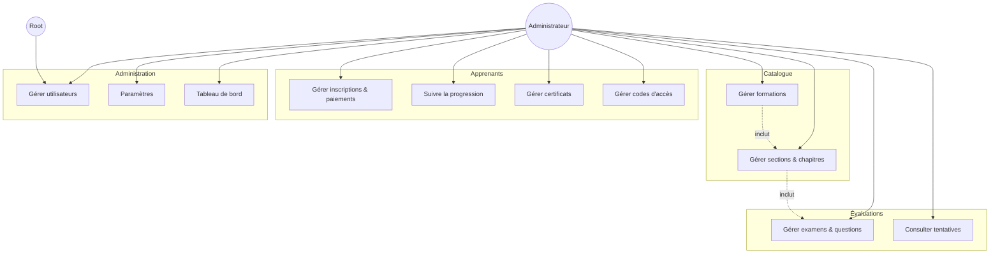
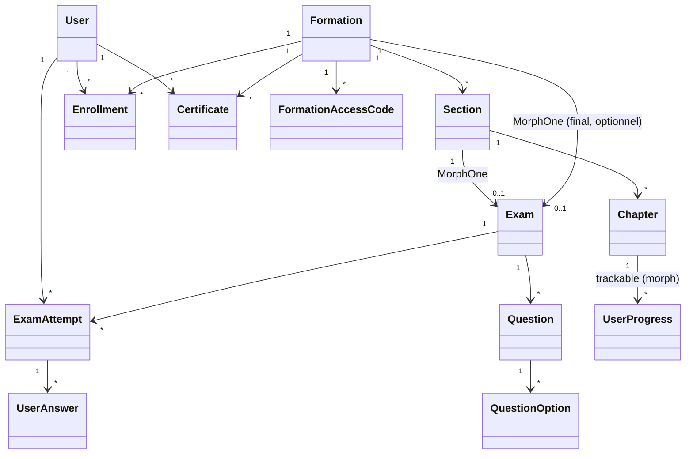
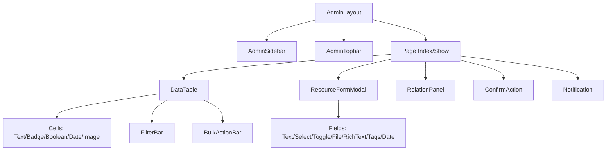
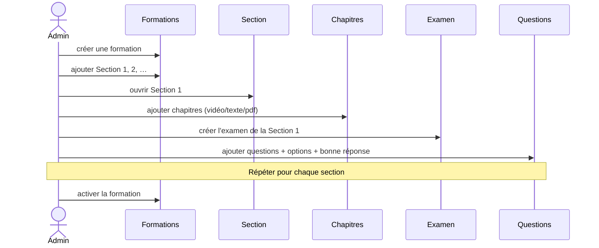
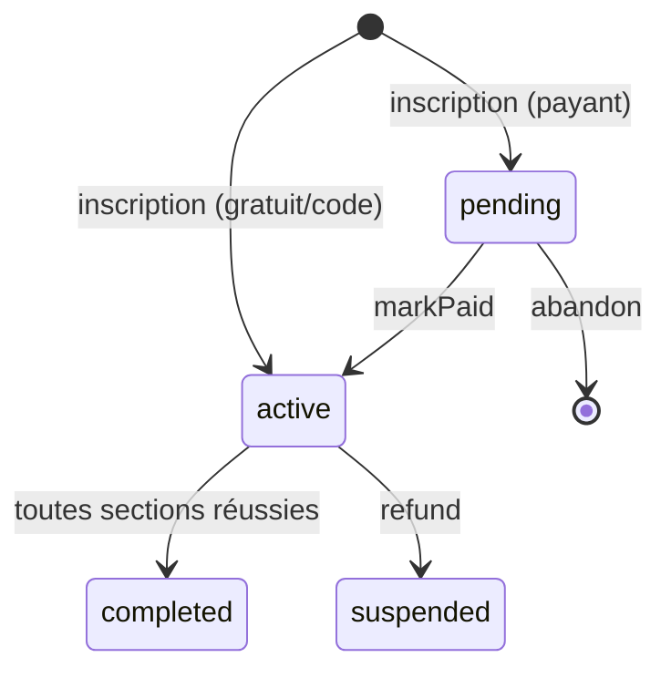
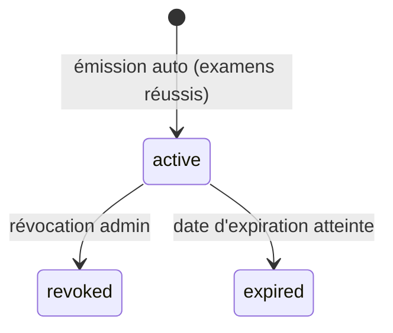

# 12 — Diagrammes globaux

## 1. Diagramme de cas d'utilisation (administration)

## 2. Modèle du domaine (classes participantes globales)

## 3. Architecture des composants front (cible)

## 4. Diagramme d'interaction — flux « construire un cours » (de bout en bout)

## 5. Diagramme d'état — statut d'une inscription

## 6. Diagramme d'état — cycle d'un certificat

