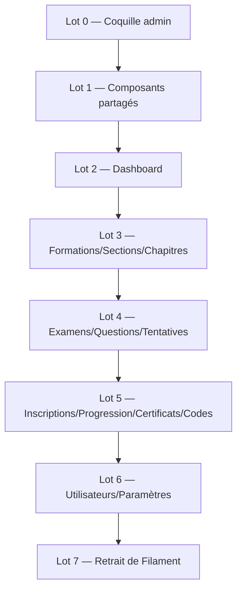

# 13 — Plan de migration par lots

## 1. Ordre recommandé (du socle au nettoyage)

| Lot | Contenu | PRD | Sortie |
|---|---|---|---|
| 0 | Layout admin, routes `/admin`, middleware `admin.access`, login | 01 | Coquille Inertia fonctionnelle |
| 1 | DataTable, FilterBar, ResourceFormModal, Fields, ConfirmAction, BulkActionBar, RelationPanel | 01 | Briques réutilisables testées |
| 2 | Dashboard + widgets | 02 | `/admin` rendu Inertia |
| 3 | Formations, Sections, Chapitres (extraction PDF) | 03, 04 | Catalogue admin migré |
| 4 | Examens, Questions, Options, Tentatives | 05 | Évaluations migrées |
| 5 | Inscriptions, Progression, Certificats, Codes | 06, 07, 08, 09 | Apprenants migrés |
| 6 | Utilisateurs, Paramètres | 10, 11 | Administration migrée |
| 7 | `composer remove filament/*`, suppression `app/Filament/**` + `AdminPanelProvider` | — | Zéro Filament |

## 2. Check‑list par ressource (Definition of Done)

- [ ] Contrôleur `index/store/update/destroy` + actions custom (routes nommées `admin.*`).
- [ ] Form Request(s) avec règles + messages.
- [ ] Policy + `Gate::authorize` dans chaque méthode.
- [ ] Page `Index.vue` via `DataTable` (tri/recherche/filtre/pagination **serveur**).
- [ ] Création/édition via `ResourceFormModal` (ou page dédiée si formulaire lourd).
- [ ] Actions custom = `ConfirmAction`/boutons → endpoints.
- [ ] Relations = `RelationPanel`.
- [ ] Uploads → disque `public`, anciens fichiers supprimés au remplacement.
- [ ] Eager‑loading (pas de N+1) + `withCount` pour les compteurs.
- [ ] Tests feature (contrôleur) + test de rendu de la page (`assertInertia`).

## 3. Correspondances Filament → Inertia (récapitulatif)

| Filament | Cible |
|---|---|
| Panel / `canAccessPanel` | routes `/admin` + middleware `admin.access` |
| Resource `table()` | `DataTable` + `columns` |
| Resource `form()` | `ResourceFormModal` + `Field*` + Form Request |
| `Filters\*` | `FilterBar` → query params |
| `CreateAction/EditAction` | modale create/edit |
| `DeleteAction` | `ConfirmAction(method:delete)` |
| `BulkAction` | `BulkActionBar` → endpoint bulk |
| `Action::make()` custom | route dédiée + bouton/confirm |
| `RelationManager` | `RelationPanel` (onglet) |
| `FileUpload` | `FileField` + `store()` |
| `RichEditor` | `RichTextField` |
| Widgets | `StatCard`/`ChartCard` + endpoints JSON |
| Notifications | flash Inertia + `Notification.vue` |
| Policies/`can()` | `Policy` Laravel |

## 4. Tests à prévoir

- **Contrôleurs** : index (contrat Inertia, filtres, pagination), store/update (validation, persistance),
  destroy, actions custom (activate, refund, revoke, duplicate, toggle…).
- **Autorisation** : un non‑admin est refusé (`admin.access`) ; garde‑fous de rôle (root vs admin).
- **Relations** : panneaux listent les bons enregistrements.
- **Services réutilisés** : extraction PDF (chapitre), progression/certificat inchangés.

## 5. Risques résiduels & décisions à acter

- **Éditeur riche** : choisir la lib (TipTap conseillé) — impacte `RichTextField`.
- **Graphiques** : `vue-chartjs` vs autre — impacte `ChartCard`.
- **Examen final de formation** (`Formation::exam`) : conservé optionnel, non utilisé par le certificat
  (basé sur les examens de section). À confirmer si on l'expose dans l'admin.
- **Rôle `instructor`** : prévu dans l'enum mais non utilisé ; les Policies peuvent l'anticiper.

## 6. Critère final

`/admin` 100 % Inertia/Vue, `composer remove filament/filament filament/* ` possible, `app/Filament/**`
et `AdminPanelProvider` supprimés, suite de tests verte. (Mêmes garanties que la migration
Livewire → Inertia côté étudiant.)
